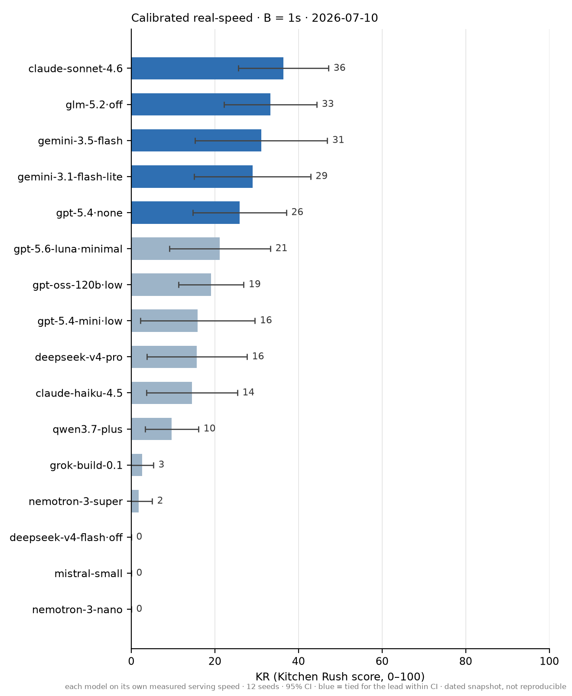
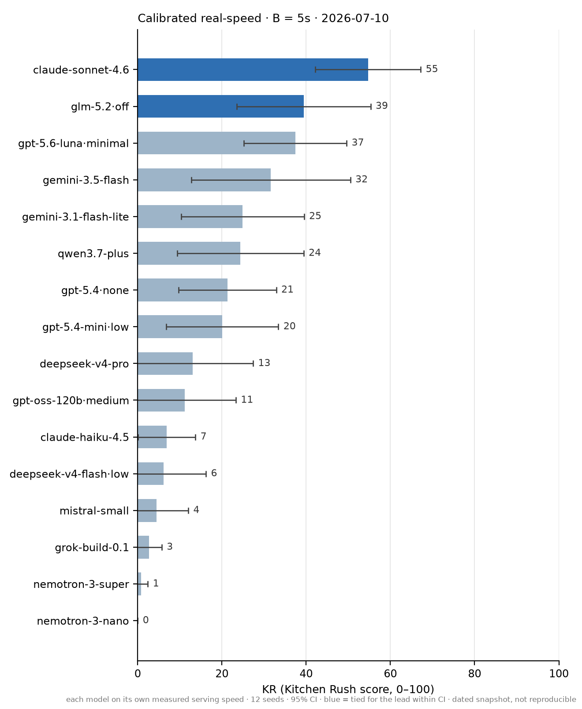

**An agent tool-calling benchmark where speed matters as much as intelligence.**

<p>
  <a href="LICENSE"></a>
  
  
  
</p>

<p align="center">
  
</p>

## Why this exists

Most tool-calling benchmarks (BFCL, τ-bench, ToolSandbox, AppWorld) check *whether* a model
makes the right calls — and the world politely waits while it thinks. That's fine for offline
tasks. But if you're building a voice assistant, a live-ops agent, or anything realtime, you
care about two things at once: **does the model do the right thing, and does it do it fast
enough?** A model that finds the perfect answer after thirty seconds of reasoning is, for you,
the wrong model.

Kitchen Rush measures both at once, by construction: the time a model spends thinking is
converted into game time that passes *before* its actions land. While the model deliberates,
food keeps cooking, food burns, and order deadlines slip away. Speed and accuracy aren't two
charts you squint at — they're one score, experienced the way a deployment would experience
them.

## How it works

The model plays a chef in an [Overcooked](https://github.com/HumanCompatibleAI/overcooked_ai)-style
kitchen. Orders stream in (burgers, soups, ramen…), and the model fulfils them with ordinary
**native function calls** — `collect`, `chop`, `cook`, `plate`, `serve` — racing deadlines,
burn timers, and a combo bonus for consecutive successful dishes. Three deliberate changes from
Overcooked:

1. **Latency is the game.** Every model response first charges its thinking time to the shared
   world clock, then its actions execute. (You can chain several calls in one response and pay
   the latency once — decisiveness is rewarded.)
2. **No joystick skills.** The chef walks itself to the right station automatically; travel
   time is charged inside the action. What's being tested is *choosing the right action
   sequence under time pressure*, not video-game reflexes.
3. **Deterministic + auditable.** For a fixed clock, the same seed and action sequence reproduce
   exactly the same episode; every run replays in a browser viewer. The board clocks each model on
   its *own measured serving speed*, so the board itself is a dated snapshot (see
   [Leaderboard](#leaderboard)).

Every episode produces a single 0–100 score we call **KR** (the **Kitchen Rush score**). It's
graded on a curve between two fixed anchors: KR 0 means "no better than doing nothing and
letting every order expire," and KR 100 means "matched a scripted reference chef that plays
the same kitchen with zero latency."

A worked example makes it concrete. Say that on one kitchen the do-nothing chef finishes at
**−60** points (every order expired), the zero-latency reference chef finishes at **+140**,
and your model finishes at **+40**. There are 200 points between the two anchors and your
model covered 100 of them, so its KR is **50** — it closed half the gap to the reference.
Average that over many seeded kitchens and you have the leaderboard number
([docs/METHODOLOGY.md](docs/METHODOLOGY.md) has the full formula).

## The latency budget (B)

Here's the knob that makes Kitchen Rush flexible: every kitchen is generated **at a latency
budget `B`** (`--latency-budget`, in seconds per decision). Think of B as **the pace the
kitchen is priced for**: order deadlines are set so that a chef spending exactly B seconds on
each decision can finish every order, with roughly 1.4–1.6× headroom to spare. Each B gets its
own leaderboard — results at different budgets are never averaged together.

For the mathematically inclined, the pricing is exact:

```
deadline = arrival + ⌈σ · C(B)⌉,   where C(B) = A + K·B
```

`A` is the order's intrinsic cooking/walking time, `K` is how many decisions a competent plan
needs, and σ is the headroom (1.4–1.6 by tier). So a model that actually decides in ℓ seconds
gains or loses `K·(B − ℓ)` seconds of breathing room per order. Faster than B? You bank slack
and serve while orders are still worth full value. Slower? You eat through the headroom, and
orders start becoming unfinishable at around `ℓ ≈ B + (σ−1)·C(B)/K` — about 3–4 s/decision at
B=1 on the current tiers, which is exactly where our calibration sweep shows the reference
chef collapsing ([docs/METHODOLOGY.md §2](docs/METHODOLOGY.md),
[docs/CALIBRATION.md](docs/CALIBRATION.md)).

And in plain deployment terms: **the model that wins at B=1s is the best pick when every
decision has to land in about a second** — terse, single-shot tool dispatch, what a voice agent
needs. **B=5s** gives about five seconds per decision — room for a short burst of reasoning, what
an interactive assistant can afford. The same model can rank very differently at the two budgets,
and that reordering is precisely what the benchmark is for.

## Leaderboard

Kitchen Rush clocks each model on **its own real, measured serving speed**: we sample each
model's live API latency, fit a per-model clock, freeze it, and run the game on that clock. A
model that's genuinely slow in production pays for it; a model on fast silicon is rewarded. It's
the deployment question made concrete — *which model actually keeps up if you ship it today?*
Each latency budget **B** gets its own board (never averaged together).

<p align="center">
  
  
</p>

16 models · 12 seeds · one kitchen · snapshot **2026-07-10**. Bars are mean KR, whiskers are 95%
confidence intervals; blue = tied for the lead within CI. Full tables (serve%, $/Mtok, and a
per-model calibration appendix of measured decode speed + chosen reasoning level) are at
[leaderboard/results/calibrated_board.md](leaderboard/results/calibrated_board.md); the build
methodology is [docs/CALIBRATED_SPEED.md](docs/CALIBRATED_SPEED.md).

**`claude-sonnet-4.6` leads both budgets** (KR 36 at B=1, 55 at B=5) — genuinely fast *and*
accurate on its own clock, not merely token-efficient. **`glm-5.2` is the value pick**:
runner-up at both budgets (33 / 39) for **~$0.33/Mtok, roughly 10× cheaper than sonnet's
~$3.19**. And the **B=1 → B=5 flip is the product**: under tight realtime pressure (~1 s per
decision) the fast, low-reasoning models hold the podium; give every decision five seconds and
the reasoners climb — `gpt-5.6-luna` jumps 21 → 37 into third. Same models, different budget,
different winner.

**Reasoning effort is calibrated per model, not assumed — and the best level is
clock-dependent.** On its real measured speed each model gets the level that actually wins:
`gpt-5.4-mini` → `low`, `gpt-5.6-luna` → `minimal`, while `gpt-5.4` and `glm-5.2` run **reasoning
off** at both budgets — on their measured speed, thinking doesn't pay for itself even at B=5. A
fast-served model can afford to think; a slow-served one can't. That's the latency tax, now
measured per model rather than charged at a single flat rate.

Two honest caveats. **(1) This board is not reproducible.** It's clocked on real, *dated* API
measurements, so re-measuring on another day/region/backend can move a model's speed and thus its
score — the deliberate trade for deployment realism (see
[docs/CALIBRATED_SPEED.md](docs/CALIBRATED_SPEED.md) and
[docs/LIMITATIONS.md](docs/LIMITATIONS.md) §1). **(2) One kitchen × one budget is 12 episodes**,
so the CIs are wide and ranks are shown as **bands** — rows in a band are statistically tied, not
meaningfully ordered. `llama-4-scout` is absent (its provider errored during calibration).

<sub>An earlier flat-clock generation — one shared, provider-neutral token clock, so it's fully
reproducible but blind to real serving speed — is archived at
[leaderboard/results/board.md](leaderboard/results/board.md) for anyone who wants a
hardware-independent ranking instead of a deployment snapshot.</sub>

## Try it

Two minutes — run the scripted reference chef locally (no model calls):

```bash
pip install -e .                          # the core has zero dependencies
kitchenrush bench --baseline random --tier easy --seeds 12 --trials 2
kitchenrush calibrate --tier easy --latency-budget 1   # see how the reference chef degrades with latency

# watch a game in the browser (scripted chef):
kitchenrush replay --oracle --tier easy --seed 0       # writes ui/replays/easy_seed0.json
cd ui && python3 -m http.server 8000                   # then open http://localhost:8000
# ...or race up to 4 models side-by-side on one clock: ?replays=a.json,b.json (see ui/README.md)
```

To benchmark a real model, add provider support and your API key:

```bash
pip install -e '.[providers]'
kitchenrush bench --model anthropic:claude-sonnet-4-6 --tier medium --latency-budget 1
```

Any LiteLLM-routable model works via `provider:model`. You can also plug in a fully custom
client — it only needs a `name` and a `generate(system, messages, tools) -> ModelResponse`
method, registered with `register_adapter`. CLI commands: `run`, `bench`, `replay`, `seeds`,
`calibrate`.

## Learn more

- [docs/RULES.md](docs/RULES.md) — the authoritative, code-verified ruleset
- [docs/METHODOLOGY.md](docs/METHODOLOGY.md) — the KR metric, the math of B, statistical protocol
- [docs/CALIBRATION.md](docs/CALIBRATION.md) — the evidence behind the gen-1.0 freeze
- [docs/CALIBRATED_SPEED.md](docs/CALIBRATED_SPEED.md) — the calibrated real-speed board's build
  spec: speed & reasoning-level calibration, QA gates, cost controls
- [docs/LIMITATIONS.md](docs/LIMITATIONS.md) — what KR does and doesn't measure (worth reading
  before citing results)
- [docs/OBJECTIONS.md](docs/OBJECTIONS.md) — anticipated critiques, answered with data
- [docs/SUBMISSIONS.md](docs/SUBMISSIONS.md) · [docs/CONTAMINATION.md](docs/CONTAMINATION.md) —
  leaderboard contract & data hygiene

## Citation

If you use Kitchen Rush in your work, please cite it (machine-readable copy in
[CITATION.cff](CITATION.cff)):

```bibtex
@software{kitchenrush2026,
  author = {Eledath, Bassim},
  title  = {Kitchen Rush: A Benchmark for Accurate and Fast Tool Calling},
  url    = {https://github.com/bassimeledath/kitchen-rush},
  year   = {2026}
}
```

## License

Apache-2.0. See [LICENSE](LICENSE).
