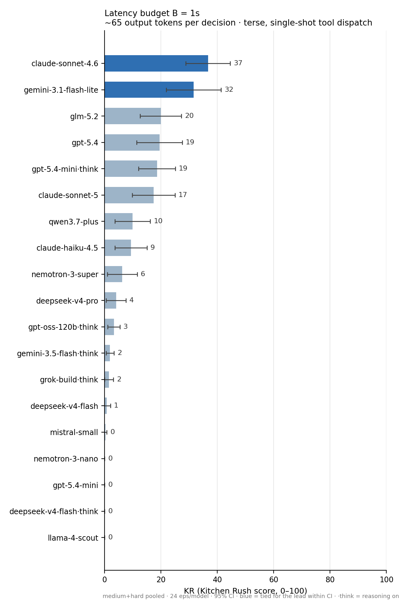
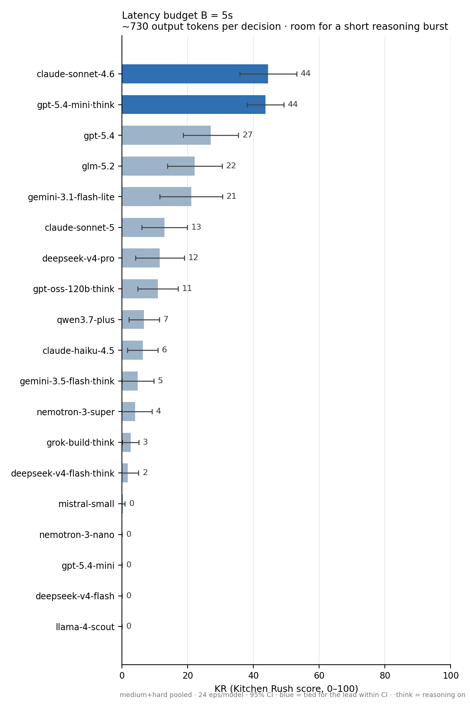
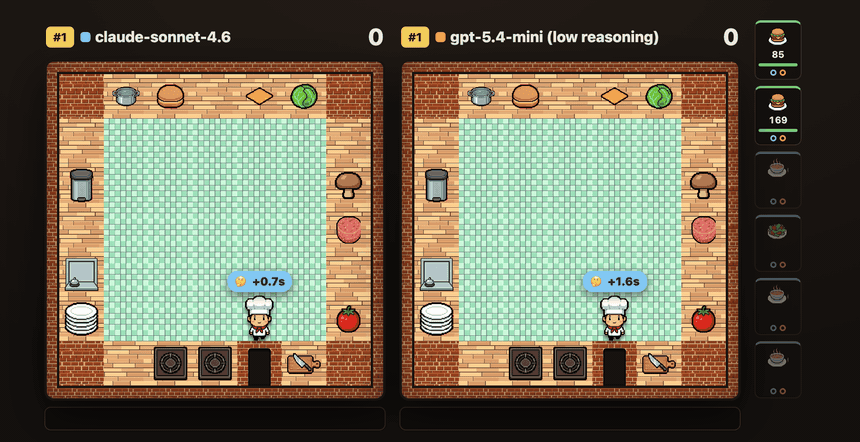

**An agent tool-calling benchmark where speed matters as much as intelligence.**

<p>
  <a href="LICENSE"></a>
  
  
  
</p>

<p align="center">
  
</p>

## Why this exists

Most tool-calling benchmarks (BFCL, τ-bench, ToolSandbox, AppWorld) check *whether* a model
makes the right calls — and the world politely waits while it thinks. That's fine for offline
tasks. But if you're building a voice assistant, a live-ops agent, or anything realtime, you
care about two things at once: **does the model do the right thing, and does it do it fast
enough?** A model that finds the perfect answer after thirty seconds of reasoning is, for you,
the wrong model.

Kitchen Rush measures both at once, by construction: the time a model spends thinking is
converted into game time that passes *before* its actions land. While the model deliberates,
food keeps cooking, food burns, and order deadlines slip away. Speed and accuracy aren't two
charts you squint at — they're one score, experienced the way a deployment would experience
them.

## How it works

The model plays a chef in an [Overcooked](https://github.com/HumanCompatibleAI/overcooked_ai)-style
kitchen. Orders stream in (burgers, soups, ramen…), and the model fulfils them with ordinary
**native function calls** — `collect`, `chop`, `cook`, `plate`, `serve` — racing deadlines,
burn timers, and a combo bonus for consecutive successful dishes. Three deliberate changes from
Overcooked:

1. **Latency is the game.** Every model response first charges its thinking time to the shared
   world clock, then its actions execute. (You can chain several calls in one response and pay
   the latency once — decisiveness is rewarded.)
2. **No joystick skills.** The chef walks itself to the right station automatically; travel
   time is charged inside the action. What's being tested is *choosing the right action
   sequence under time pressure*, not video-game reflexes.
3. **Fully deterministic.** Same seed, same actions, same latencies → exactly the same episode,
   every time, on any machine. Every run can be replayed in a browser viewer and audited.

Every episode produces a single 0–100 score we call **KR** (the **Kitchen Rush score**). It's
graded on a curve between two fixed anchors: KR 0 means "no better than doing nothing and
letting every order expire," and KR 100 means "matched a scripted reference chef that plays
the same kitchen with zero latency."

A worked example makes it concrete. Say that on one kitchen the do-nothing chef finishes at
**−60** points (every order expired), the zero-latency reference chef finishes at **+140**,
and your model finishes at **+40**. There are 200 points between the two anchors and your
model covered 100 of them, so its KR is **50** — it closed half the gap to the reference.
Average that over many seeded kitchens and you have the leaderboard number
([docs/METHODOLOGY.md](docs/METHODOLOGY.md) has the full formula).

## The latency budget (B)

Here's the knob that makes Kitchen Rush flexible: every kitchen is generated **at a latency
budget `B`** (`--latency-budget`, in seconds per decision). Think of B as **the pace the
kitchen is priced for**: order deadlines are set so that a chef spending exactly B seconds on
each decision can finish every order, with roughly 1.4–1.6× headroom to spare. Each B gets its
own leaderboard — results at different budgets are never averaged together.

For the mathematically inclined, the pricing is exact:

```
deadline = arrival + ⌈σ · C(B)⌉,   where C(B) = A + K·B
```

`A` is the order's intrinsic cooking/walking time, `K` is how many decisions a competent plan
needs, and σ is the headroom (1.4–1.6 by tier). So a model that actually decides in ℓ seconds
gains or loses `K·(B − ℓ)` seconds of breathing room per order. Faster than B? You bank slack
and serve while orders are still worth full value. Slower? You eat through the headroom, and
orders start becoming unfinishable at around `ℓ ≈ B + (σ−1)·C(B)/K` — about 3–4 s/decision at
B=1 on the current tiers, which is exactly where our calibration sweep shows the reference
chef collapsing ([docs/METHODOLOGY.md §2](docs/METHODOLOGY.md),
[docs/CALIBRATION.md](docs/CALIBRATION.md)).

And in plain deployment terms: **the model that wins at B=1s is the best pick when every
decision has to land in about a second** — on the benchmark's reproducible clock that's a
budget of roughly 65 output tokens per decision, i.e. terse, single-shot tool dispatch — what a
voice agent needs. **B=5s** buys about 730 tokens per decision — enough for a short burst of
reasoning, what an interactive assistant can afford. The same model can rank very differently on the
two boards, and that reordering is precisely what the benchmark is for.

## Leaderboard

19 model configurations × 12 seeds × {medium, hard} kitchens × two latency budgets — 912
episodes so far. Each chart is one latency budget; bars are mean KR, whiskers are 95%
confidence intervals. The full per-tier table (with costs, reasoning tokens, and serve rates)
is at [leaderboard/results/board.md](leaderboard/results/board.md).

<p align="center">
  
  
</p>

**The left board (B=1s)** is the realtime test: the kitchen is priced for one second per
decision, which on the benchmark's clock buys about 65 output tokens — terse, single-shot tool
dispatch. Winning here means "the model I'd trust to drive a voice agent or a live dashboard."
**The right board (B=5s)** prices the same kitchens for five seconds per decision (~730
tokens — room for a short burst of reasoning), what an interactive assistant can afford.

Read them side by side — that contrast is the product. Under tight realtime pressure (B=1s)
the fast no-reasoning models hold the podium: `gemini-3.1-flash-lite` runs nearly even with
`claude-sonnet-4.6` (32 vs 37). Give every decision five seconds instead and the board
reorders: `gpt-5.4-mini` with low reasoning rockets from near-zero to a **dead heat with
sonnet (44 vs 44) at about a fifth of the cost**, while flash-lite *drops* to half its B=1
standing. The same mini with reasoning fully off scores 0.0 at both budgets — reasoning it
can't afford at B=1 is exactly what makes it a frontier-level tool caller at B=5. That's the
latency tax, made visible. (`·think` rows ran with reasoning on at low effort; everything
else with reasoning off — fast single-shot dispatch is the honest realtime default. One row
you might expect is missing: there is no `claude-sonnet-4.6·think`, because Anthropic's API
does not allow extended thinking when tool calls are forced, and the harness forces tool
calls — sonnet competes thinking-off only.)

**Case study — newest ≠ fastest (`claude-sonnet-5`).** Anthropic's newest flagship lands *6th*
at KR 15.1 — below `gpt-5.4`, `gemini-3.1-flash-lite`, and `glm-5.2`. This isn't a harness
artifact: every one of its 48 episodes produced well-formed, correctly-parsed tool calls (zero
malformed, zero dropped). The failure is a real **cook-spam spiral** — on hard kitchens it calls
`cook` far more than `collect_cooked` (61 vs 11 in one episode), so food piles up and *burns*
(12–42 burns/episode vs ~3–4 for every other Anthropic model) and its later `cook`s fail on full
burners. Like every board model it competes reasoning-off — doubly so, since Anthropic forbids
thinking when tool calls are forced. Its new *adaptive* thinking API is also a measurement edge
case worth flagging: it returns reasoning **encrypted** and reports `reasoning_tokens: 0` even
while spending ~1000 hidden thinking tokens per decision, so under RP's provider-trusted rule
([§3.2.1](docs/RULES.md), [docs/LIMITATIONS.md](docs/LIMITATIONS.md)) a thinking-on run would
think essentially *for free* — a probe that allowed it (`tool_choice:auto`) duly logged an
untrustworthy ~44, and charging that hidden thinking honestly drops it *below* its reasoning-off
row, so no thinking-on number is published. Either way, out of the box in the realtime regime the
newest flagship plays *worse* than its predecessor — raw capability and realtime tool-calling
skill are not the same axis, which is the whole point of this benchmark.

*(`glm-5.2` is a second instance of the same lesson, found the hard way: it was briefly listed
2nd overall and tied for the B=5 lead, but that run priced its ~500-token-per-decision reasoning
at zero — a reasoning-token reporting gap since fixed. Charged correctly it scores 5.8 at B=5;
run reasoning-off like every other plain row it settles at ~21 overall, ~5th. Expensive reasoning
is a net negative at a fixed latency budget — the recurring finding.)*

<p align="center">
  
</p>
<p align="center"><em>The flip, watched live: the same two models from the clip at the top,
but in a kitchen priced at B=5s. Now the mini's reasoning burst is affordable — it finishes
every order at <b>99</b> raw points (KR 86) while sonnet is still cooking at 40. This is the
mini's best kitchen — the chart above shows the average, a 44–44 tie across all 24 — but the
direction is real: it wins the medium tier at B=5 outright (59 vs 52). Same models, different
latency budget, different winner: that's exactly what the two boards measure.</em></p>

## Try it

Two minutes — run the scripted reference chef locally (no model calls):

```bash
pip install -e .                          # the core has zero dependencies
kitchenrush bench --baseline random --tier easy --seeds 12 --trials 2
kitchenrush calibrate --tier easy --latency-budget 1   # see how the reference chef degrades with latency

# watch a game in the browser (scripted chef):
kitchenrush replay --oracle --tier easy --seed 0       # writes ui/replays/easy_seed0.json
cd ui && python3 -m http.server 8000                   # then open http://localhost:8000
# ...or race up to 4 models side-by-side on one clock: ?replays=a.json,b.json (see ui/README.md)
```

To benchmark a real model, add provider support and your API key:

```bash
pip install -e '.[providers]'
kitchenrush bench --model anthropic:claude-sonnet-4-6 --tier medium --latency-budget 1
```

Any LiteLLM-routable model works via `provider:model`. You can also plug in a fully custom
client — it only needs a `name` and a `generate(system, messages, tools) -> ModelResponse`
method, registered with `register_adapter`. CLI commands: `run`, `bench`, `replay`, `seeds`,
`calibrate`.

## Learn more

- [docs/RULES.md](docs/RULES.md) — the authoritative, code-verified ruleset
- [docs/METHODOLOGY.md](docs/METHODOLOGY.md) — the KR metric, the math of B, statistical protocol
- [docs/CALIBRATION.md](docs/CALIBRATION.md) — the evidence behind the gen-1.0 freeze
- [docs/LIMITATIONS.md](docs/LIMITATIONS.md) — what KR does and doesn't measure (worth reading
  before citing results)
- [docs/OBJECTIONS.md](docs/OBJECTIONS.md) — anticipated critiques, answered with data
- [docs/SUBMISSIONS.md](docs/SUBMISSIONS.md) · [docs/CONTAMINATION.md](docs/CONTAMINATION.md) —
  leaderboard contract & data hygiene

## Citation

If you use Kitchen Rush in your work, please cite it (machine-readable copy in
[CITATION.cff](CITATION.cff)):

```bibtex
@software{kitchenrush2026,
  author = {Eledath, Bassim},
  title  = {Kitchen Rush: A Benchmark for Accurate and Fast Tool Calling},
  url    = {https://github.com/bassimeledath/kitchen-rush},
  year   = {2026}
}
```

## License

Apache-2.0. See [LICENSE](LICENSE).
